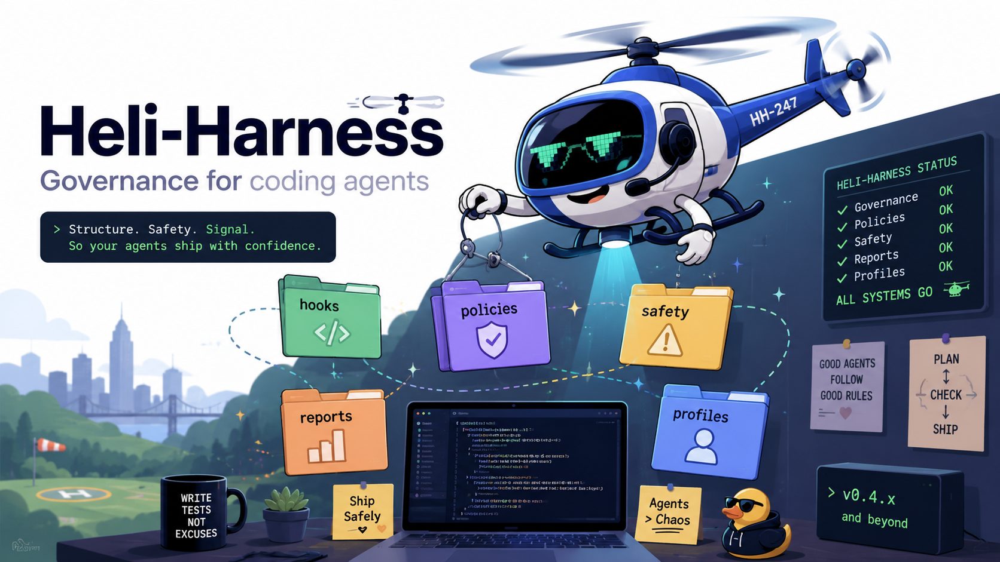

# Heli-Harness

<p align="center">
  
</p>

<p align="center">
  <a href="LICENSE"></a>
  <a href="CHANGELOG.md"></a>
  <a href="https://github.com/KJ-AIML/heli-harness/actions/workflows/ci.yml"></a>
  <a href="docs/ADAPTER_SUPPORT_MATRIX.md"></a>
</p>

**A shared governance layer for coding agents working across many repos.**

Codex, Claude Code, Cursor, Pi — drop any of them into a workspace with a dozen repos and they'll each guess differently at where the source of truth is, which repo they're supposed to be editing, and what "done" looks like. Heli-Harness gives them one shared answer instead of a dozen guesses.

The source of truth lives in `.heli-harness/HARNESS.md`. Tool-specific behavior lives only under `.heli-harness/adapters/`. Everything else — profiles, policies, state, hooks — hangs off that.

## 🤔 Why this exists

When multiple agents work across many repos in one workspace, they need shared answers to:

- Where's the source of truth?
- Which repo am I actually supposed to be editing right now?
- What's the current task, and did the last agent leave notes?
- Which of the 23 bundled skills actually apply here?
- What does *this* repo forbid, recommend, or require — as opposed to what it merely happens to do today?

Heli-Harness answers all five without replacing your repo-local docs.

## 🧭 How it thinks about the problem

> Facts describe. Policies decide. Safety enforces. Reports prove.

- **Facts** — repo profiles record what exists, evidence-linked, not guessed.
- **Policies** — overlays say what's required, recommended, forbidden, or needs approval.
- **Safety** — hooks and command tiers block or surface risky actions where the host supports it.
- **Reports** — every run has to show its work: files touched, commands run, risks left open.

It is *not* an agent runtime, a planner, or an orchestrator — see [ROADMAP.md](ROADMAP.md#what-heli-is-not) for the full list of things it deliberately isn't.

## 🚀 Quickstart

Ask your agent, from the parent folder that contains your repos:

```
Install this repo into the current folder as a parent-workspace harness:

https://github.com/KJ-AIML/heli-harness

Use the latest stable tag (v0.5.12). Do not install globally. Treat the current
directory as the workspace. Verify .heli-harness/HARNESS.md, AGENTS.md,
and CLAUDE.md exist after install.
```

That's it — one prompt, one workspace. For manual/scripted installs, Pi/AXGA package mode, uninstall, and update, see **[INSTALL.md](INSTALL.md)**.

<details>
<summary>What it feels like day-to-day</summary>

```
You: Add rate-limiting middleware to the auth service.

Agent:
  1. Reads .heli-harness/HARNESS.md
  2. Identifies target repo: auth-service/
  3. Reads .heli-harness/profiles/auth-service.md
  4. Reads auth-service/README.md, package.json, test setup
  5. Updates .heli-harness/state/current-task.md
  6. Implements rate-limiting
  7. Runs tests per profile
  8. Updates state on completion
```

</details>

## 🔌 Supported agents

**Adapter status taxonomy:**
- **enforced** - Runtime hook/tool-call guard is verified and tested
- **verified-plugin-wired** - Native plugin artifacts are shipped and smoke-tested; runtime enforcement is not proven
- **plugin-wired** - Native plugin artifacts exist but lack smoke tests
- **verified-wired** - Instruction/pointer adapter artifacts are smoke-tested; runtime enforcement is not proven
- **wired** - Files/config/install paths exist and are validated
- **documented** - Documentation exists, but no verified wiring or runtime enforcement
- **planned** - Roadmap item exists, but no shipped adapter wiring yet
- **unsupported** - Explicitly not supported

Every command below is what actually works today against the real, locally installed CLI — nothing here needs a published marketplace listing.

### Claude Code — `enforced`

```bash
claude --plugin-dir .heli-harness/adapters/claude-plugin
```

Loads the native plugin for that session. Live-verified: a real session denies `git push` and `.env` writes and reports it in `permission_denials`. For the full workspace harness instead, use the [Quickstart](#-quickstart) above.

### Codex — `enforced`

```bash
codex plugin marketplace add ./.heli-harness/adapters/codex-plugin
codex plugin add heli-harness@heli-harness
```

Live-verified: a real `codex exec` turn denies `git push` and `.env` writes via the PreToolUse hook.

### Pi / AXGA — `enforced` (Pi) / `documented` (AXGA)

```bash
pi install git:github.com/KJ-AIML/heli-harness@v0.5.12
axga install git:github.com/KJ-AIML/heli-harness@v0.5.12
```

Loads 23 skills plus the Pi extension (hooks/guards). Then run `/heli-install` inside Pi/AXGA to set up the workspace harness — see [.heli-harness/adapters/pi/README.md](.heli-harness/adapters/pi/README.md).

### Cursor — `wired`

No plugin mechanism. After the workspace install (Quickstart above), Cursor reads `.heli-harness/adapters/cursor/CURSOR.md` on its own.

### Generic agents — `documented`

After the workspace install, point any other agent at `.heli-harness/adapters/generic/AGENT_INSTRUCTIONS.md`.

**OpenCode/Windsurf/Cline/Gemini/OpenClaw**: `planned` — no implementation yet.

Every claim above has to point at real evidence — see **[docs/ADAPTER_SUPPORT_MATRIX.md](docs/ADAPTER_SUPPORT_MATRIX.md)** for the file paths, verification commands, and limitations behind each status. Per-adapter install paths (pointer vs. native plugin) live in **[INSTALL.md](INSTALL.md)**.

## 📊 Governance benchmarks

`benchmarks/` holds repeatable templates for measuring whether Heli actually improves safety, target discipline, report completeness, and implementation quality — not just vibes. No telemetry, no required runner, all local. See **[benchmarks/README.md](benchmarks/README.md)**.

## 📚 Docs

- **[INSTALL.md](INSTALL.md)** — full install, uninstall, update, and per-adapter setup
- **[ROADMAP.md](ROADMAP.md)** — what shipped, what's next, what's deliberately out of scope
- **[docs/ADAPTER_SUPPORT_MATRIX.md](docs/ADAPTER_SUPPORT_MATRIX.md)** — evidence behind every adapter status claim
- **[docs/architecture/governance-model.md](docs/architecture/governance-model.md)** — the governance model in depth
- **[docs/research/agent-governance-research-synthesis.md](docs/research/agent-governance-research-synthesis.md)** — research synthesis behind the approach
- **[docs/decisions/0001-heli-as-governance-harness.md](docs/decisions/0001-heli-as-governance-harness.md)** — ADR 0001
- **[SECURITY.md](SECURITY.md)** — security policy

## 🤝 Contributing

See **[CONTRIBUTING.md](CONTRIBUTING.md)**.

## 📄 License

MIT. See **[LICENSE](LICENSE)**.
