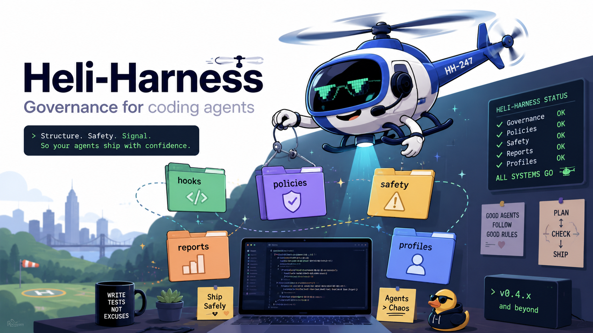

# Heli-Harness

<p align="center">
  
</p>

<p align="center">
  <a href="LICENSE"></a>
  <a href="CHANGELOG.md"></a>
  <a href="https://github.com/KJ-AIML/heli-harness/actions/workflows/ci.yml"></a>
  <a href="docs/ADAPTER_SUPPORT_MATRIX.md"></a>
</p>

**Portable governance for coding agents.** Heli-Harness v0.10.0 is a small governance and coordination kernel that gives heterogeneous coding hosts the same policy, resource-authority, approval, evidence, and explanation semantics without becoming the agent runtime.

## Current architecture

> Facts describe. Policy constrains. Authority scopes. Grants approve. Evidence explains.

Heli v0.10.0 separates four concerns that older workspace-only releases mixed together:

- **Distribution** — shared/global Heli package and host integrations.
- **Project binding** — committed `.heli/workspace.json` + `.heli/heli.lock`.
- **Operational authority** — execution-local sessions/resource authority/capability observations.
- **Governance evidence** — decisions, verifier results, and optional durable work records.

```text
Host agent / IDE
      |
      v
Adapter / hook
      |
      v
Canonical Heli evaluator + transitions
  |       |        |        |
policy  grants  authority  receipts
      |
      +--> project binding (.heli/)
      +--> trusted user config (~/.heli/)
      +--> execution-local state
```

Heli does **not** own model calls, the agent loop, a scheduler, sandbox implementation, process supervision, general memory, or conversation transcripts.

See the [current architecture index](docs/architecture/README.md) and [governance model](docs/architecture/governance-model.md).

## Install v0.10.0

The current GitHub release is `v0.10.0`. Until the npm registry has `heli-harness@0.10.0`, use the pinned GitHub package for the global CLI:

```bash
npm install -g github:KJ-AIML/heli-harness#v0.10.0
heli --version
heli setup
```

Then link a project:

```bash
cd /path/to/project
heli link
heli doctor
heli status
```

`heli setup` initializes trusted user/global Heli state. Its workspace registry is a **locator only**, never the authority owner.

`heli link` creates project binding and a fresh execution identity:

```text
project/
└── .heli/
    ├── workspace.json      # logical project/resource identity
    ├── heli.lock           # runtime/protocol/schema pins
    ├── policies/           # project may narrow policy
    ├── profiles/           # descriptive project facts
    ├── safety/             # project safety overlays
    └── skills/             # project-specific skills
```

Live grants, sessions, resource authority, credentials, runtime capability observations, and process handles are **not committed project state**.

### Existing embedded workspaces

The self-contained `.heli-harness/` layout remains supported as a compatibility/hermetic mode.

Update the embedded runtime first, make sure no embedded writer lease is active, then run:

```bash
heli link /path/to/existing-workspace
```

The cutover is fail-closed when active embedded write authority exists. Portable work/evidence may migrate; authorization does not.

For a deliberately self-contained/offline bundle, `heli install <path>` remains available. It is no longer the primary v0.10 distribution model.

Full installation and migration details: [INSTALL.md](INSTALL.md).

## Authority is resource-scoped

v0.10.0 no longer treats a narrative task name as the root write-authority boundary.

For modeled local worktrees, Heli reasons about the actual resource. A conflicting resource has one active writer authority, with generation/revision tracking and conflict-checked reacquisition.

A task can still be created for durable handoff, multi-session work, investigation, verification, or reporting. It is an optional **work record/provenance object**, not a prerequisite for every ordinary reversible edit.

## Scoped approvals

Broad bypass is no longer the preferred temporary-approval path.

Example:

```bash
heli grant issue --action git.push --scope once
heli grant list
heli grant revoke <grant-id>
```

Grants are bounded by action/resource/execution and may also be bounded by host session, time, and usage count. T6 hard-deny rules remain non-grantable.

Project-controlled files may narrow trusted policy, but cannot silently elevate the built-in/user ceiling.

## Explain and decision receipts

Human CLI, machine-readable surfaces, hooks, and explain share the same governance semantics.

Examples:

```bash
heli explain authority
heli explain capabilities
heli explain config
heli explain decision <decision-id>
```

Decision receipts preserve the normalized action/resources, policy provenance, relevant grant IDs, resource-authority generation/revision, capability evidence, reason codes, and obligations needed for bounded explanation.

Capability evidence is surface-specific: installed files or a callback observation do not automatically prove enforcement.

## Evidence portability, not authority portability

A clone or synced copy may preserve logical workspace identity and portable evidence, but it receives a new machine/execution identity.

It does **not** inherit:

- live writer authority,
- grants,
- host sessions,
- runtime capability observations,
- credentials,
- YOLO state.

Cloud sync remains optional and local-first. See [Cloud Sync](docs/architecture/cloud-sync.md).

## Host integrations

Current support claims are evidence-backed and maintained in the [Adapter Support Matrix](docs/ADAPTER_SUPPORT_MATRIX.md).

| Adapter | Current status |
| --- | --- |
| Pi | `enforced` |
| Claude Code | `enforced` |
| Codex | `enforced` |
| Cursor | `plugin-wired` |
| Grok Build | `enforced` |
| OpenCode | `enforced` |
| Kimi Code CLI | `enforced` |
| Antigravity CLI | `verified-plugin-wired` |
| AXGA / Generic | documented |
| Windsurf / Cline / Gemini / OpenClaw | planned |

These labels describe tested integration evidence, **not a sandbox or universal security boundary**.

## Validation

Repository validation:

```bash
npm run check
```

The check chain covers protocol/decision semantics, capability evidence, linked project binding, resource authority, scoped grants, portability, adapter packaging, install/update behavior, quality guards, release validation, and documentation currentness.

## Documentation

Use these as current `v0.10.0` references:

- [Architecture index](docs/architecture/README.md) — canonical current architecture entry point.
- [Governance model](docs/architecture/governance-model.md) — policy, authority, grants, decisions, evidence.
- [Install guide](INSTALL.md) — v0.10 setup/link plus embedded compatibility.
- [Adapter Support Matrix](docs/ADAPTER_SUPPORT_MATRIX.md) — current host claims and evidence.
- [Enforcement Matrix](docs/ENFORCEMENT_MATRIX.md) — current governance surface/evidence map.
- [Heli v1 Architecture Convergence RFC](docs/superpowers/specs/2026-09-18-heli-v1-architecture-convergence.md) — accepted architecture contract implemented through v0.10.0.
- [Roadmap](ROADMAP.md) — current baseline and next gates.
- [Changelog](CHANGELOG.md) — historical release facts.

Older design plans, reports, and ADRs remain only for provenance. When they describe superseded topology, they are explicitly labeled historical/superseded and link back to the current architecture index.
