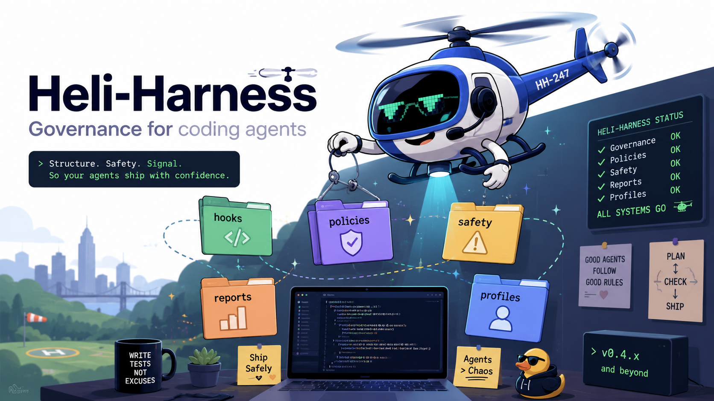
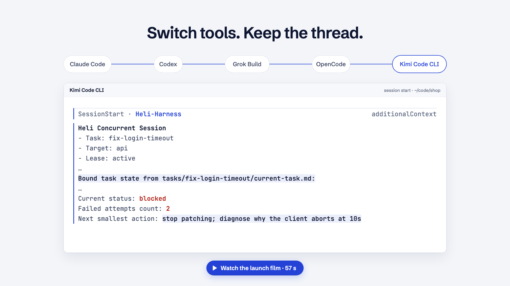

# Heli-Harness

<p align="center">
  
</p>

<p align="center">
  <a href="https://github.com/KJ-AIML/heli-harness/releases/download/v0.11.1/heli-harness-launch.mp4"></a>
  <br>
  <sub><a href="https://github.com/KJ-AIML/heli-harness/releases/download/v0.11.1/heli-harness-launch.mp4">Watch the launch film (MP4, 57 s)</a><br>Made with code using <a href="https://www.remotion.dev">Remotion</a> and Grok Bot · Voiceover: ElevenLabs · Video skill: <a href="https://github.com/KJ-AIML/product-launch-film">product-launch-film</a></sub>
</p>

<p align="center">
  <a href="LICENSE"></a>
  <a href="CHANGELOG.md"></a>
  <a href="https://github.com/KJ-AIML/heli-harness/actions/workflows/ci.yml"></a>
  <a href="docs/ADAPTER_SUPPORT_MATRIX.md"></a>
</p>

**Switch tools. Keep the thread.** Current Task and Profile carry your work across AI CLIs (Claude Code, Codex, Grok Build, OpenCode, Kimi Code CLI, Pi) with the same context and task state, and Heli's skills make the agent verify the premise and fix from evidence instead of guessing.

**Portable governance for coding agents.** Heli-Harness v0.11.1 is a small governance and coordination kernel that gives heterogeneous coding hosts the same policy, resource-authority, approval, evidence, and explanation semantics without becoming the agent runtime.

## Current architecture

> Facts describe. Policy constrains. Authority scopes. Grants approve. Evidence explains.

Heli v0.11.1 separates four concerns that older workspace-only releases mixed together:

- **Distribution** — shared/global Heli package and host integrations.
- **Project binding** — committed `.heli/workspace.json` + `.heli/heli.lock`.
- **Operational authority** — execution-local sessions/resource authority/capability observations.
- **Governance evidence** — decisions, verifier results, and optional durable work records.

```text
Host agent / IDE
      |
      v
Adapter / hook
      |
      v
Canonical Heli evaluator + transitions
  |       |        |        |
policy  grants  authority  receipts
      |
      +--> project binding (.heli/)
      +--> trusted user config (~/.heli/)
      +--> execution-local state
```

Heli does **not** own model calls, the agent loop, a scheduler, sandbox implementation, process supervision, general memory, or conversation transcripts.

See the [current architecture index](docs/architecture/README.md) and [governance model](docs/architecture/governance-model.md).

## Install v0.11.1

Install the global CLI from npm:

```bash
npm install -g heli-harness
heli --version
heli setup
heli host install all
heli host status
```

Then link a project. Host integrations are machine-level and do not need to be copied into every linked workspace:

```bash
cd /path/to/project
heli link
heli doctor
heli status
```

`heli setup` initializes trusted user/global Heli state. Its workspace registry is a **locator only**, never the authority owner.

`heli link` creates project binding and a fresh execution identity:

```text
project/
└── .heli/
    ├── workspace.json      # logical project/resource identity
    ├── heli.lock           # runtime/protocol/schema pins
    ├── policies/           # project may narrow policy
    ├── profiles/           # descriptive project facts
    ├── safety/             # project safety overlays
    └── skills/             # project-specific skills
```

Live grants, sessions, resource authority, credentials, runtime capability observations, and process handles are **not committed project state**.

### Existing embedded workspaces

The self-contained `.heli-harness/` layout remains supported as a compatibility/hermetic mode.

Update the embedded runtime first, make sure no embedded writer lease is active, then run:

```bash
heli link /path/to/existing-workspace
```

The cutover is fail-closed when active embedded write authority exists. Portable work/evidence may migrate; authorization does not.

For a deliberately self-contained/offline bundle, `heli install <path>` remains available. It is no longer the primary v0.11 distribution model.

Full installation and migration details: [INSTALL.md](INSTALL.md).

### Migrate many linked workspaces

When one machine keeps multiple Heli workspaces under a development root, migrate them from the global locator registry instead of visiting each project manually:

```bash
heli migrate --dry-run
heli migrate
heli migrate --root ~/Developer
heli migrate --root ~/Developer --discover --depth 4
```

The registry remains locator-only. Migration refreshes each linked workspace's overlays, safety defaults, and `.heli/heli.lock` to the currently installed global runtime; it does not inherit, copy, or reset live authority state. `--discover` can rebuild missing locator knowledge from committed `.heli/workspace.json` bindings after a global-state reset.

## Resume across coding tools

When one coding host runs out of usage or you deliberately switch tools, `heli resume` reconstructs the durable continuation context without inheriting the previous host's authority:

```bash
heli resume
heli resume --json
```

The packet reports Git branch/HEAD/dirty state, active tasks, dependency and handoff readiness, current resource writer, active sessions, and recorded runtime observations. It is read-only: it does not choose a task, spawn an agent, mutate Git, or transfer/take over writer authority. The new host still enters through the normal SessionStart/PreToolUse lifecycle before writing.

See [Resume context](docs/architecture/resume-context.md) for the boundary and JSON model.

## Heli Assistant skill

When the question is not "which command exists?" but **"given this workspace/session/host, what should I do now?"**, use the packaged `heli-assistant` skill.

It is a read-first situational guide. It can use version, layout, resume context, host lifecycle, runtime capability evidence, task/handoff state, target/resource context, and writer authority to explain the situation and recommend the smallest supported path.

Typical questions:

- why a host cannot write;
- how to continue after switching Codex/Grok/Claude;
- whether a durable task or handoff is actually needed;
- how to migrate an older embedded workspace;
- what a stale host/session/writer state means.

It does not spawn agents, assign work, transfer writer authority, issue grants/YOLO, sync, publish, or deploy by itself. See [Heli assistant and skill routing](docs/architecture/heli-assistant.md).

## Authority is resource-scoped

v0.11.1 no longer treats a narrative task name as the root write-authority boundary.

For modeled local worktrees, Heli reasons about the actual resource. A conflicting resource has one active writer authority, with generation/revision tracking and conflict-checked reacquisition.

A task can still be created for durable handoff, multi-session work, investigation, verification, or reporting. It is an optional **work record/provenance object**, not a prerequisite for every ordinary reversible edit.

## Scoped approvals

Broad bypass is no longer the preferred temporary-approval path. Approvals come from a **human**: `heli grant issue` and `heli yolo on` only run in an interactive terminal, and the Heli hooks hard-deny them when a coding agent tries to run them itself.

Example (run in your own terminal):

```bash
heli grant issue --action git.push --scope once
heli grant list
heli grant revoke <grant-id>
```

Grants are bounded by action/resource/execution and may also be bounded by host session, time, and usage count. Each matched T5 rule needs its own grant, and a grant is used up only when the call is finally allowed. T6 hard-deny rules — including Heli's built-in floor — remain non-grantable.

Project-controlled files may narrow trusted policy, but cannot silently elevate the built-in/user ceiling.

## Explain and decision receipts

Human CLI, machine-readable surfaces, hooks, and explain share the same governance semantics.

Examples:

```bash
heli explain authority
heli explain capabilities
heli explain config
heli explain decision <decision-id>
```

Decision receipts preserve the normalized action/resources, policy provenance, relevant grant IDs, resource-authority generation/revision, capability evidence, reason codes, and obligations needed for bounded explanation.

Capability evidence is surface-specific: installed files or a callback observation do not automatically prove enforcement.

## Evidence portability, not authority portability

A clone or synced copy may preserve logical workspace identity and portable evidence, but it receives a new machine/execution identity.

It does **not** inherit:

- live writer authority,
- grants,
- host sessions,
- runtime capability observations,
- credentials,
- YOLO state.

Cloud sync remains optional and local-first. See [Cloud Sync](docs/architecture/cloud-sync.md).

## Host integrations

Current support claims are evidence-backed and maintained in the [Adapter Support Matrix](docs/ADAPTER_SUPPORT_MATRIX.md).

The support matrix tracks runtime evidence, fresh install, global discovery, linked-project support, update/repair, removal, automated E2E, live-host proof, and distribution currency as separate dimensions.

Managed lifecycle:

```bash
heli host install <host>
heli host status
heli host update <host>
heli host repair <host>
heli host remove <host>
```

Pi, Claude Code, Codex, Grok Build, OpenCode, Kimi Code CLI, Cursor, and AXGA have managed machine-level lifecycle surfaces. Antigravity is managed when its version-specific plugin parent is supplied through `HELI_ANTIGRAVITY_PLUGIN_DIR`. Generic remains an instruction-only fallback.

Runtime evidence is still evaluated independently: installed files are **not** a sandbox, a universal security boundary, or proof that a host invoked Heli.

## Validation

Repository validation:

```bash
npm run check
```

The check chain covers protocol/decision semantics, capability evidence, linked project binding, resource authority, scoped grants, portability, adapter packaging, install/update behavior, quality guards, release validation, and documentation currentness.

## Documentation

Use these as current `v0.11.1` references:

- [Architecture index](docs/architecture/README.md) — canonical current architecture entry point.
- [Governance model](docs/architecture/governance-model.md) — policy, authority, grants, decisions, evidence.
- [Install guide](INSTALL.md) — v0.11 setup/link plus embedded compatibility.
- [Adapter Support Matrix](docs/ADAPTER_SUPPORT_MATRIX.md) — current host claims and evidence.
- [Enforcement Matrix](docs/ENFORCEMENT_MATRIX.md) — current governance surface/evidence map.
- [Heli v1 Architecture Convergence RFC](docs/superpowers/specs/2026-09-18-heli-v1-architecture-convergence.md) — accepted architecture contract implemented through v0.11.1.
- [Roadmap](ROADMAP.md) — current baseline and next gates.
- [Changelog](CHANGELOG.md) — historical release facts.

Older design plans, reports, and ADRs remain only for provenance. When they describe superseded topology, they are explicitly labeled historical/superseded and link back to the current architecture index.
